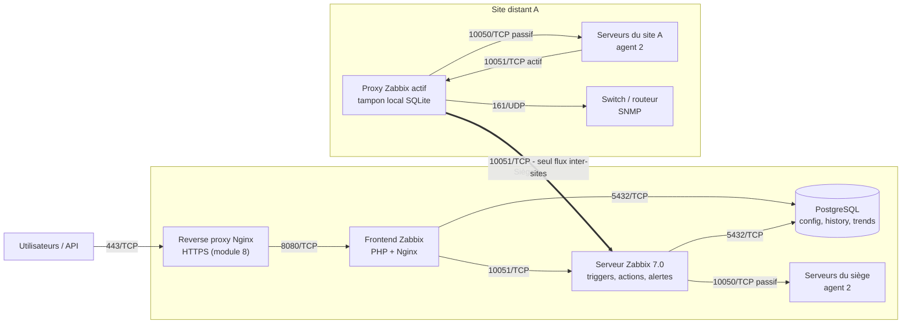

# Architecture de référence — Zabbix 7.0 LTS multi-sites

Architecture cible du lab : un siège (serveur central) et un site distant supervisé via un proxy actif.
Les flèches partent de l'élément qui **initie** la connexion (sens à utiliser pour les règles de pare-feu).

## Matrice des flux

| Source (initie) | Destination | Port | Usage |
|---|---|---|---|
| Utilisateurs | Reverse proxy | 443/TCP | Interface web et API en HTTPS |
| Reverse proxy | Frontend | 8080/TCP | Frontend non exposé directement |
| Frontend | PostgreSQL | 5432/TCP | Configuration, affichage |
| Frontend | Serveur | 10051/TCP | Statut, tests d'items, scripts |
| Serveur | PostgreSQL | 5432/TCP | Configuration, history, trends, événements |
| Serveur | Agents du siège | 10050/TCP | Checks passifs |
| Proxy site A | Serveur | 10051/TCP | Seul flux entre le site et le siège |
| Proxy site A | Agents du site A | 10050/TCP | Checks passifs (flux local au site) |
| Agents du site A | Proxy site A | 10051/TCP | Checks actifs, logs |
| Proxy site A | Équipements réseau | 161/UDP | Polling SNMP |

## Choix d'architecture

- **Proxy actif par site distant** : un seul flux sortant vers le siège, rien à exposer sur le site ; collecte maintenue en cas de coupure grâce au tampon local.
- **Le serveur central garde seul l'intelligence** : évaluation des triggers et envoi des alertes.
- **PostgreSQL = point critique** : supervisée, sauvegardée ; sans base, plus d'alertes fiables.
- **Reverse proxy devant le frontend** : terminaison TLS, frontend non exposé directement.
- **Chiffrement PSK** (module 8) sur les flux agents et proxy, sur les mêmes ports.

## Évolutions possibles (hors lab)

- Proxy groups (7.0) : plusieurs proxies par site, bascule automatique.
- Haute disponibilité native du serveur (depuis 6.0) ; la base doit être rendue redondante séparément.
- TimescaleDB pour les gros volumes d'historique.
- Déploiement des agents et des proxies par Ansible.
